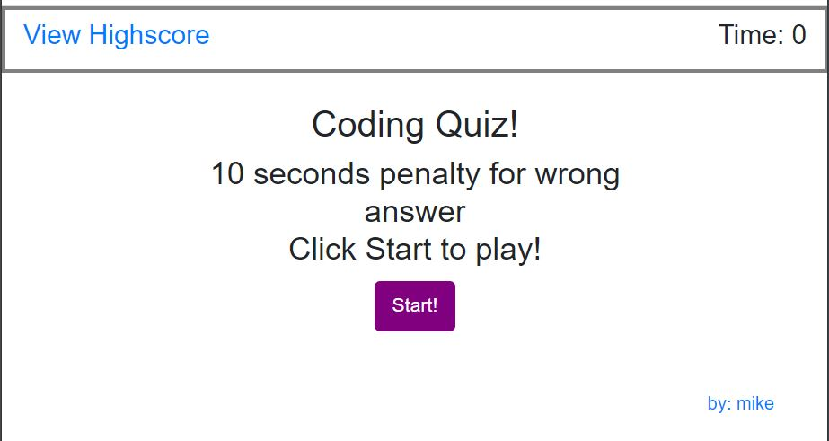
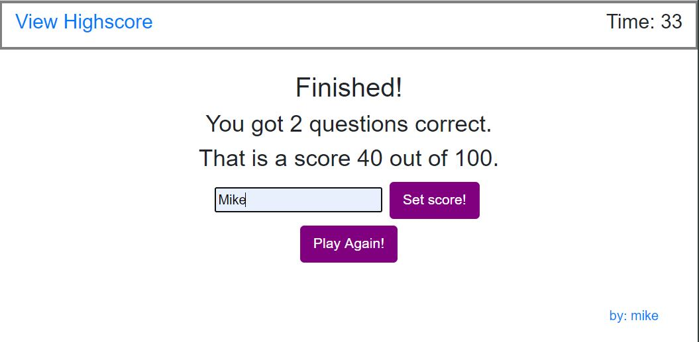

# 04 Web APIs: Code Quiz

The APP is a coding assessment timed quiz with multiple-choice questions. 
It's a quiz on JavaScript fundamentals and will store your score and initials when you finish or when time is over.
This app will run in the browser and feature dynamically updated HTML and CSS powered by JavaScript code. 
It will also feature a clean and polished user interface and be responsive, ensuring that it adapts to multiple screen sizes.


## Acceptance Criteria

Click the start button to take the code quiz
THEN a timer starts and you be presented with a question
WHEN you answer a question
THEN you are presented with another question
WHEN you answer a question incorrectly
THEN time is subtracted from the clock
WHEN all questions are answered or the timer reaches 0
THEN the game is over
WHEN the game is over
THEN you can save your initials and score.
```

The following is screenshot of app:

